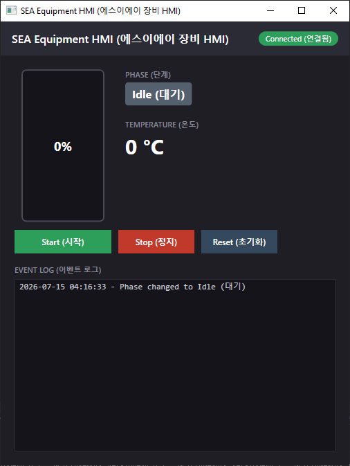
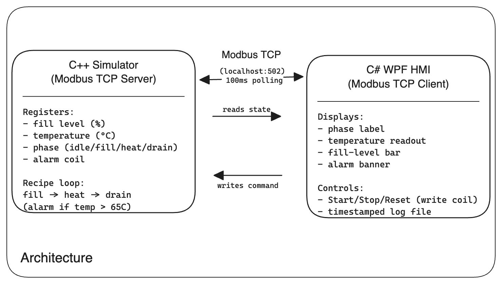

# PLC-to-PC Equipment Control Demo

A two-process demo exploring how industrial equipment control migrates from PLC-based logic to PC-based systems — the same architectural pattern used across manufacturing and semiconductor/solar equipment control software. It pairs a simulated PLC (C++) with a desktop operator HMI (C#/WPF), talking to each other over real Modbus TCP — the same industrial protocol used in production equipment control, not a stand-in like REST or a shared file.

I built this to get genuinely hands-on with C++, C#, and Modbus-based equipment control: writing the recipe state machine and the protocol handling myself, rather than just describing the concepts.

<table>
<tr>
<td width="50%">


</td>
<td width="50%">

</td>
</tr>
</table>

## Architecture



- **C++ side** — the simulated PLC. No GUI. Runs a Modbus TCP server and an internal recipe state machine that advances a wet-process tank over time, independent of whether a client is connected.
- **C# side** — the HMI. A WPF desktop app acting as a Modbus TCP client: polls the server every 100ms, renders live state, and writes operator commands back.

## Tech Stack

| Component | Choice | Notes |
|---|---|---|
| Simulator language | C++ | Real C++, not a stand-in — CMake build, single executable |
| Simulator Modbus library | [libmodbus](https://libmodbus.org/) | Homebrew on macOS/Linux, vcpkg on Windows |
| HMI language | C# (.NET 8, WPF) | WPF is Windows-only |
| HMI Modbus library | [EasyModbus](https://www.nuget.org/packages/EasyModbusTCP) (NuGet) | |
| Protocol | Modbus TCP, `127.0.0.1:502` | Same wire-level pattern used in real PLC-to-PC control migrations |

## Data Model

| Register/Coil | Address | Meaning |
|---|---|---|
| Fill level | Holding register 0 | 0–100 (%) |
| Temperature | Holding register 1 | 0–100 (°C) |
| Phase | Holding register 2 | 0=idle, 1=filling, 2=heating, 3=draining |
| Alarm | Coil 0 | Set by the server when temperature exceeds 65°C |
| Control | Coil 1 | Written by the HMI: 1=start, 0=stop/reset |

Recipe timing: filling ramps 0→100% over ~5s, heating ramps toward a 60°C target over ~8s, draining ramps 100→0% over ~5s. The simulator ticks its state machine every ~200ms.

## Getting Started

### Prerequisites

- **C++ simulator**: CMake 3.16+, a C++17 compiler, and libmodbus
  - macOS/Linux: `brew install libmodbus cmake` (or your distro's package manager)
  - Windows: [vcpkg](https://vcpkg.io) with `vcpkg install libmodbus`, plus Visual Studio with the "Desktop development with C++" workload
- **C# HMI** (Windows only): .NET 8 SDK, Visual Studio 2022+ with the ".NET desktop development" workload

### 1. Build and run the C++ simulator (the "PLC")

```bash
cd cpp-simulator
cmake -S . -B build
# On Windows, point at your vcpkg toolchain file instead:
#   cmake -S . -B build -DCMAKE_TOOLCHAIN_FILE=<path-to-vcpkg>/scripts/buildsystems/vcpkg.cmake
cmake --build build
./build/sea_plc_simulator          # Windows: build\Debug\sea_plc_simulator.exe
```

It starts listening on `127.0.0.1:502` and begins ticking its internal state machine immediately, whether or not an HMI is connected. Port 502 is a privileged port on macOS/Linux, so it may need `sudo` there.

### 2. Build and run the C# HMI

Open `csharp-hmi/SeaHmiDemo.csproj` in Visual Studio (this restores the EasyModbus NuGet package automatically), then build and run — or from a terminal:

```powershell
cd csharp-hmi
dotnet build
dotnet run
```

The HMI polls for the simulator automatically and connects on its next poll tick once it's reachable — no manual reconnect needed, and it doesn't matter which process you start first. Press **Start (시작)** to run a full fill → heat → drain cycle; phase transitions and alarm events are written to `equipment_log.txt` next to the executable.

## Scope & Limitations

This is a demo built to explore the architecture and protocol, not production equipment-control software:

- No real hardware or PLC integration — the "PLC" is entirely simulated in software
- No batch/multi-unit support — a single simulated tank, one cycle at a time
- No authentication, security hardening, or multi-user support
- No persistence beyond a local timestamped log file
- No automated test suite — verified manually, including live fault injection over Modbus to exercise the alarm path
